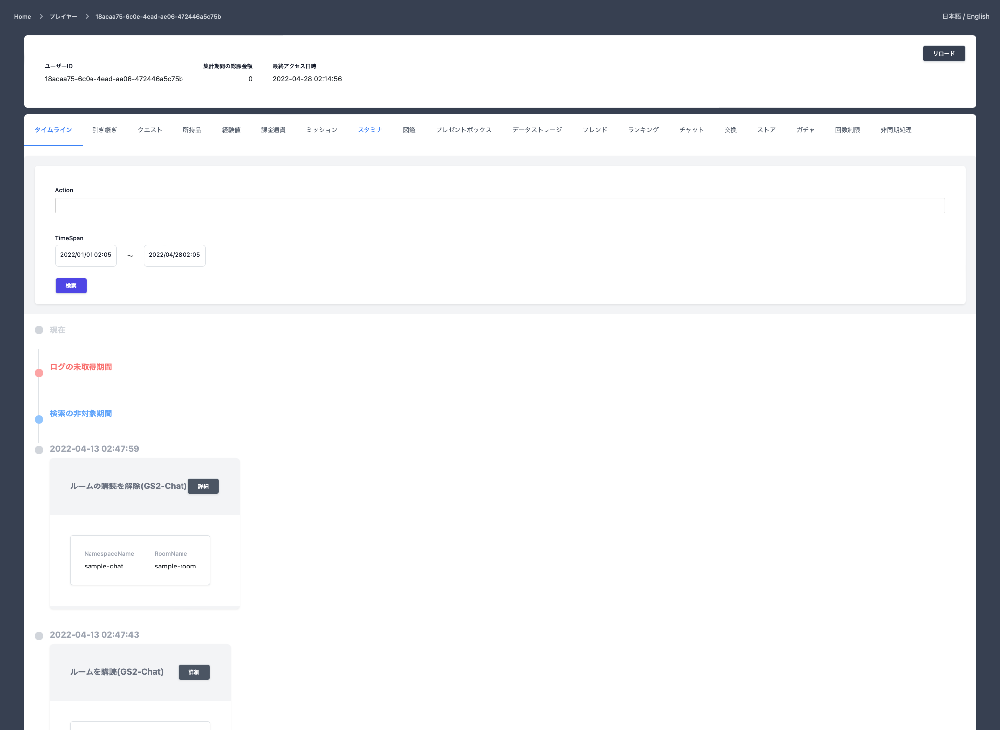
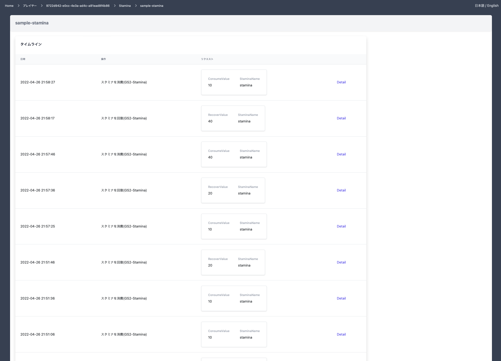
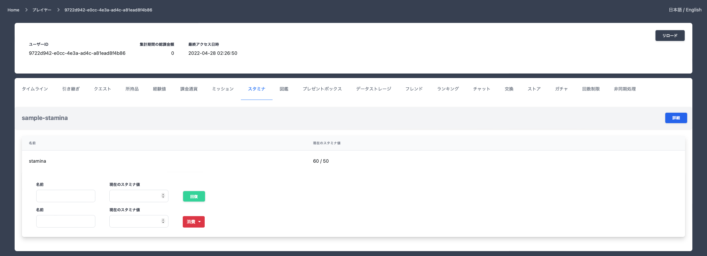
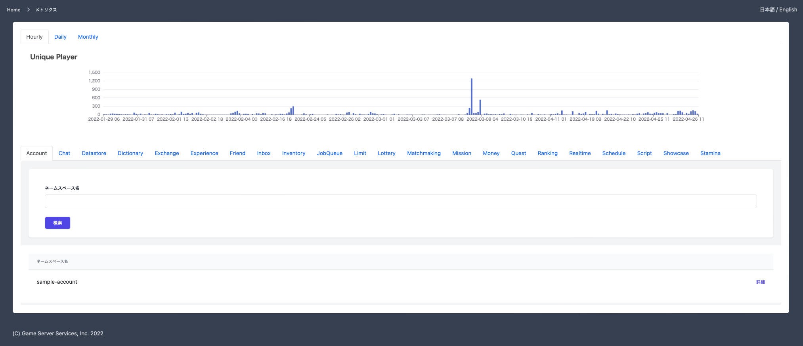
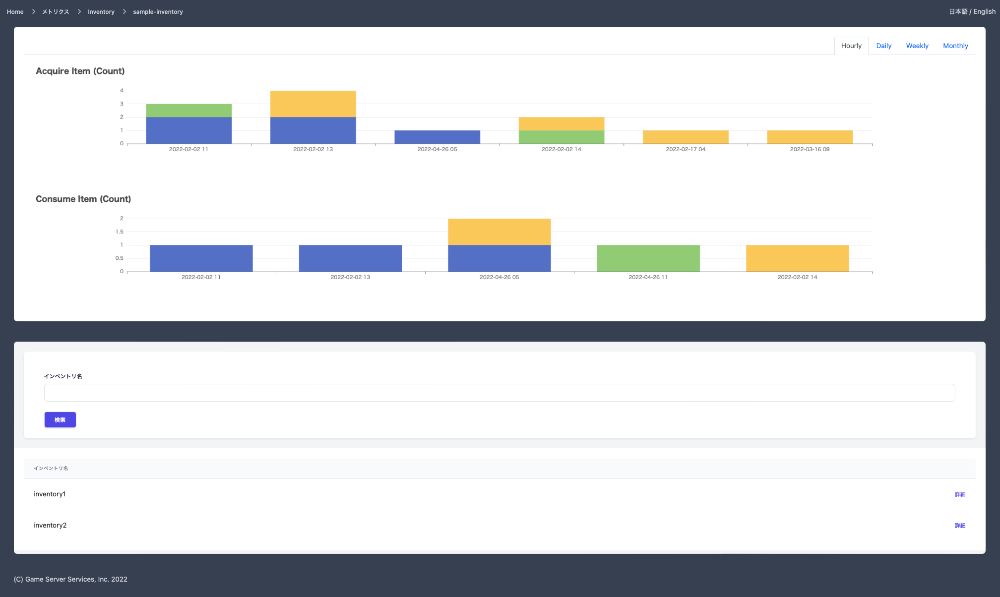
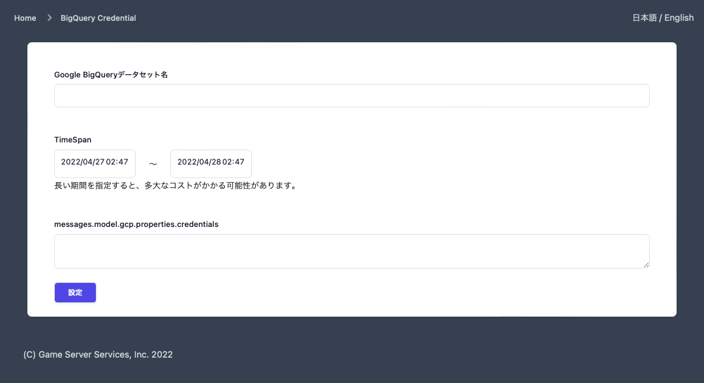
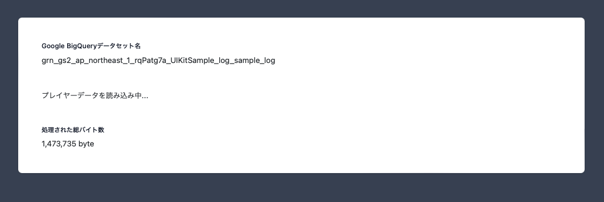
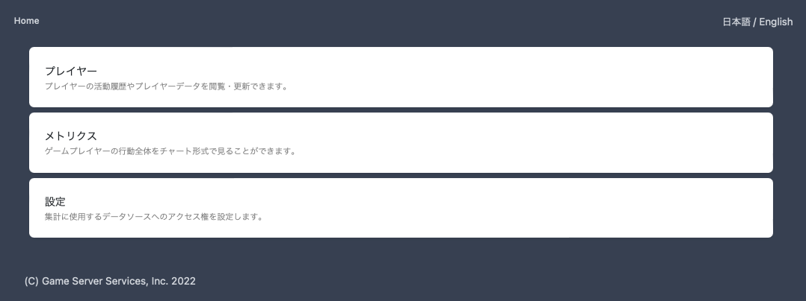
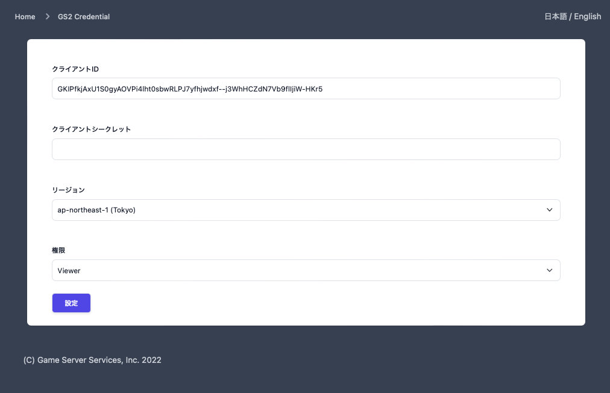

# What is GS2-Insight

GS2-Insight is a tool to analyze and visualize [GS2](https://gs2.io) service access logs exported by GS2-Log.
It has two main functions.
- Visualization of game player activity
- Visualization of overall game activity

## Visualization of game player activity

### Timeline


You can view game player activity in chronological order.


A timeline can also be displayed for each GS2 microservice resource.
This feature allows specific users to see acquisition and consumption activity related to specific items.

### Current Status



You can also visualize the current state of the player by setting the GS2 API access rights separately from the GS2 access log access rights.
GS2 access authorization settings can be made via security policies assigned to credentials, but three levels of authorization settings can also be made on the GS2-Insight UI.

Viewer: Displays the latest GS2 values

Operator: In addition to the privileges of the Viewer, can manipulate values to the advantage of the game player.

Administrator: In addition to the privileges of the Operator, can perform operations that are detrimental to the game player.

## Visualization of overall game activity



The access logs provide metrics that can be used to manage the game.



Data such as the number of times each item is obtained, the quantity obtained, the number consumed, and the quantity consumed can also be visualized.

Such data can be used to identify items that are depleted in the game, review rewards to eliminate bottlenecks in the game cycle, and help in decision making to determine the featured items to pay out at events.

## How to use

GS2-Insight is available immediately using Docker compose.
First, check out this repository and enter the following command in the checked out directory.

```shell
docker compose up  
```

The web server will then start.
Access http://localhost/ with your browser.



When you access the system, you must first set up access privileges to the access log.

Set the name of the BigQuery dataset set in GS2-Log and the GCP credentials to access it.

Next, set the time period to be visualized.
Be careful not to set a longer time period than necessary here.

Because BigQuery charges for the amount of data scanned when a query is executed, you can save money by limiting the period of time for aggregation to what you need.



Once the configuration is complete, a scan of the data on BigQuery will begin.
The amount of data read during the scan will also be displayed, so please use this information as a guide for the fee.

After a few minutes of waiting, the basic data buildup is complete and you are ready to start using GS2-Insight.



When the preparation is complete, you will be redirected to the Home screen.
Congratulations! You now have the world's easiest game activity data analysis environment.



If you want to take more advantage of GS2-Insight, you should set up additional credentials to call GS2-API from the Settings menu.
By setting up credentials here, you will be able to view the current state as well as past player activity on GS2-Insight, and manipulate player data.

